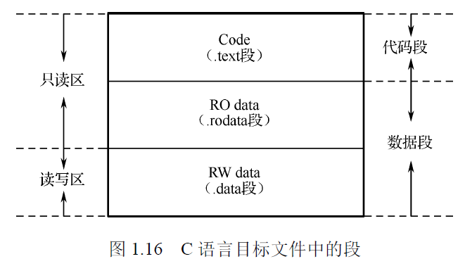

# 目标文件（.o文件）

注：从嵌入式课本中摘抄，可能有错

## 组成

目标文件由三部分组成：
1. 代码段（.text/.code段，只读）：由代码部分生成的二进制机器码
2. 只读数据段（.rodata段，read-only data）：由程序中使用的常量组成，比如`const`限定的常量和赋值语句需要使用的常量（如：`a = 7;`）
3. 读写数据段（.data段，RW data）：已初始化的全局变量、静态变量（函数中`static`限定的变量），未初始化（未赋初值的定义）的变量不会在这里（而是在.bss段）

代码在运行时会再产生两部分：
1. .bss段（Block Started by Symbol segment）：未初始化的全局变量、静态变量。在目标文件中，未初始化的变量只会被标识其内存分配的信息，然后在运行时产生.bss段来存储。
2. 堆栈：分为栈区和堆区
    1. 栈区（stack）用来存放：
        1. 函数中没有被`static`限定的变量，即动态变量/局部变量
        2. 函数调用时被现场保护的参数
        3. 函数的返回值
    2. 堆区（heap）：用于存放进程运行中被动态分配的数据内存段。**与数据结构中的堆不是一个东西**。一般由程序员分配和释放（`malloc`/`calloc`/`recalloc`/`free`等），程序执行完毕后，未被释放的内存由操作系统释放。

## 链接

将各.o文件的代码段、RO data段、RW data段拆开，然后各自分类组合，就得到了.exe文件。.exe文件的某一段由所有.o文件的某一段合并而来

编译器把源代码编译为目标文件，链接器使用目标文件(.obj)、库函数和对应系统的启动代码(startup code)生成可执行文件(.exe)。只有在程序中用到的库函数代码会被链接到可执行文件中

## 运行

程序运行时，内存中分为两种区域：静态区在最前面，剩下的都作为动态区在后面

### .exe内机器码

.exe内机器码会被加载到静态区，有下面两种可能：

1. 全部加载到内存中运行：执行速度快但占用内存多
2. 只将RW data段加载到内存中：因为要从ROM中读取代码，执行速度稍慢但节省内存

### 运行时初始化的数据

1. bss段，放在静态区最后面
2. heap，放在动态区最前面
3. stack，放在动态区最后面
